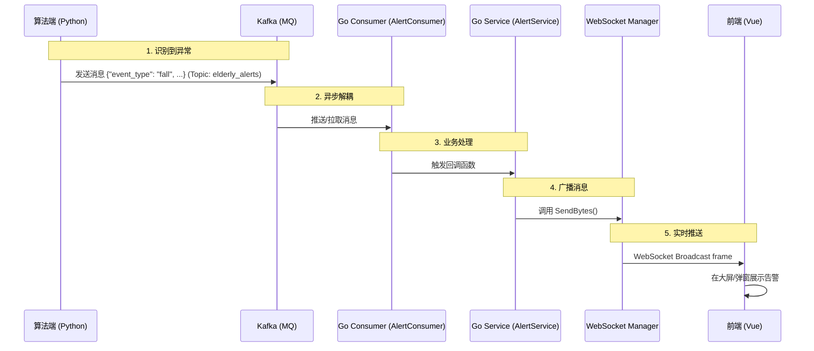

# 智慧养老预警系统接口与实现文档

本文档详细描述了智慧养老系统的实时预警功能，包括 Kafka 消息格式、WebSocket 接口定义以及后端实现流程。

---

## 1. 接口文档 (Interface Documentation)

### 1.1 Kafka 消息接口 (Python Algorithm -> Go Backend)

算法端通过 Kafka 异步上报检测到的异常事件。

- **Topic**: `elderly_alerts`
- **消息格式**: JSON
- **方向**: 算法端 (Producer) -> 后端 (Consumer)

#### 数据结构 (JSON Schema)

| 字段名 | 类型 | 说明 | 示例值 |
| :--- | :--- | :--- | :--- |
| `event_type` | string | 事件类型（如跌倒、求助、情绪异常） | `"fall"` |
| `timestamp` | int64 | 事件发生的时间戳（秒） | `1716234567` |
| `level` | string | 告警级别 (`critical`, `warning`, `info`) | `"critical"` |
| `message` | string | 告警描述信息 | `"检测到老人跌倒"` |
| `video_url` | string | 相关证据视频/图片连接 | `"/evidence/20240520_1030.mp4"` |

#### 示例 Payload

```json
{
  "event_type": "fall",
  "timestamp": 1716234567,
  "level": "critical",
  "message": "检测到老人跌倒",
  "video_url": "/evidence/20240520_1030.mp4"
}
```

---

### 1.2 WebSocket 接口 (Go Backend -> Vue Frontend)

前端通过 WebSocket 长连接接收实时推送的告警信息。

- **Endpoint URL**: `ws://<server_host>:8081/api/ws/alerts`
- **协议**: WebSocket
- **鉴权**: (当前版本暂无 token 校验，后续可在 URL 参数中添加 Token)

#### 通信流程
1. **连接**: 客户端发起 WS 连接请求。
2. **保持**: 连接建立后，服务器维护该连接（心跳保活由标准 TCP/WS 协议处理）。
3. **推送**: 当 Kafka 收到新消息时，服务器即便将消息 JSON 广播给所有在线客户端。
4. **断开**: 客户端或服务器均可断开连接，服务器会自动清理断开的 Client。

#### 推送消息格式
服务器原样转发 Kafka 收到的 JSON 数据（经过序列化）。

```json
{
  "event_type": "fall",
  "timestamp": 1716234567,
  "level": "critical",
  "message": "检测到老人跌倒",
  "video_url": "/evidence/20240520_1030.mp4"
}
```

---

## 2. 流程实现文档 (Implementation Flow)

### 2.1 整体架构图



### 2.2 核心模块说明

系统主要由三个核心模块组成，通过 Google Wire 依赖注入进行管理。

#### 1. Kafka Consumer (`internal/mq/kafka_consumer.go`)
- **职责**: 作为消费者组 `elderly-alert-group` 监听 Kafka topic。
- **实现**: 使用 `sarama` 库。
- **并发**: 在独立的 Goroutine 中运行 `Consume` 循环，保证不阻塞主线程。
- **扩展性**: 支持通过 `SetMessageHandler` 注入回调逻辑，实现与业务逻辑解耦。

#### 2. WebSocket Manager (`internal/ws/websocket_manager.go`)
- **职责**: 维护所有活跃的前端 WebSocket 连接。
- **模式**: 采用 **Hub Pattern**。
    - `clients`: 线程安全的 Map，存储所有在线连接。
    - `broadcast`: 广播通道，接收待发送的消息。
    - `register/unregister`: 处理连接建立与断开。
- **性能**: 使用读写锁 (`sync.RWMutex`) 保护连接池，确保高并发下的线程安全。

#### 3. Alert Service (`internal/service/alert_service.go`)
- **职责**: “胶水层”模块，连接 Consumer 和 WebSocket Manager。
- **逻辑**: 
    1. 应用启动时，调用 `Start()`。
    2. 设置 Consumer 的回调：收到消息 -> JSON 序列化 -> 调用 WS Manager 广播。
    3. 启动 Consumer 监听。

### 2.3 关键代码路径

1. **应用启动 (`app.go`)**:
   - 初始化 `AlertService`。
   - 调用 `app.AlertService.Start()`。
   
2. **依赖注入 (`internal/ioc`)**:
   - `minimal_sets.go` 注册了 `mq.NewAlertConsumer`, `ws.NewWebSocketManager`, `service.NewAlertService`。
   - `gin.go` 注册了 WebSocket 路由 GET `/api/ws/alerts`。

3. **消息流转**:
   - Python 发送 -> Kafka `elderly_alerts` -> Go `mq.AlertConsumer` -> `service.AlertService` 回调 -> `ws.WebSocketManager` Broadcast -> Vue 客户端。

---

## 3. 前端对接建议 (Vue)

### 示例代码

```javascript
// alert-ws.js
let socket = null;

export function connectWebSocket() {
  socket = new WebSocket("ws://localhost:8081/api/ws/alerts");

  socket.onopen = () => {
    console.log("预警系统连接成功");
  };

  socket.onmessage = (event) => {
    const alertData = JSON.parse(event.data);
    console.log("收到预警:", alertData);
    // TODO: 触发全局弹窗或更新 Vuex/Pinia 状态
    // handleAlert(alertData);
  };

  socket.onclose = () => {
    console.log("连接断开，5秒后重连...");
    setTimeout(connectWebSocket, 5000);
  };

  socket.onerror = (error) => {
    console.error("WS 错误:", error);
  };
}
```
